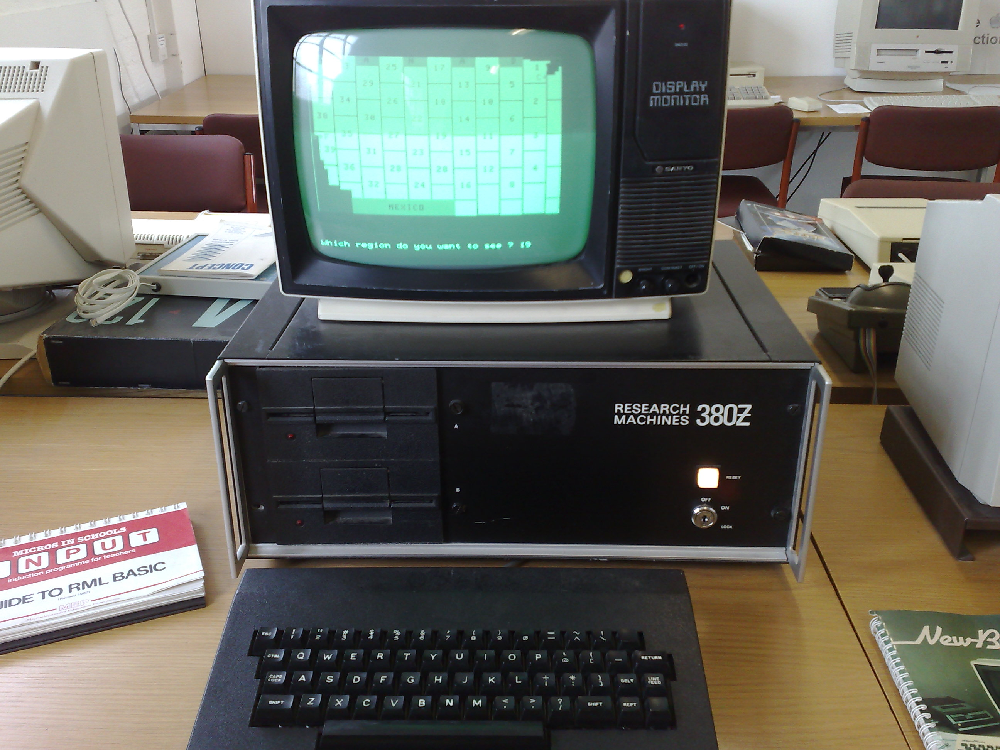

# How hard can it be?

Very...

James Murphy - @recumbent

---

@snap[west span-40]
### James Murphy - Software Engineer
@snapend

@snap[east span-40]

@snapend

---

# Problem -> Cloud

---

# Step 1: It works on my machine

---

# Step 2: Cloud

`dotnet lambda deploy-function quote-function`

---

Problems

* Not reliable
* Not repeatable
* Not scaleable

---

Solution

* CI/CD Pipeline

---

# What does that look like

+++

Simple version:

- Build
- Deploy

+++

Full Version

@ul

- Build
- Package
- Black Box test
- Publish
- Deploy
- Quality Gate
- Promote
- Deploy
- etc...

@ulend

---

# CircleCI

SaaS build server based on docker

---

# Script 

Wall of YAML

---

